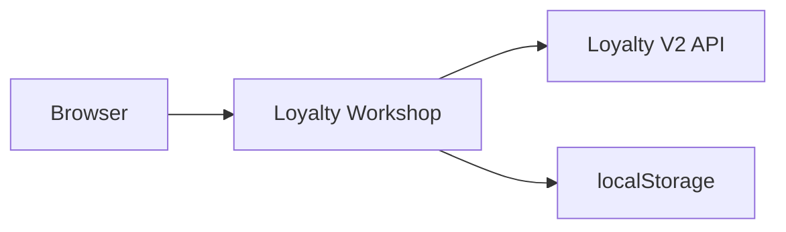
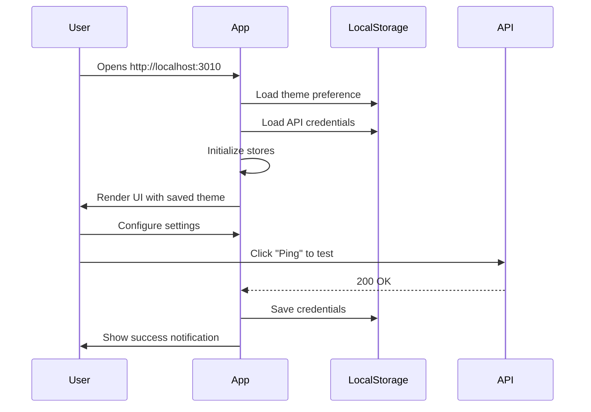
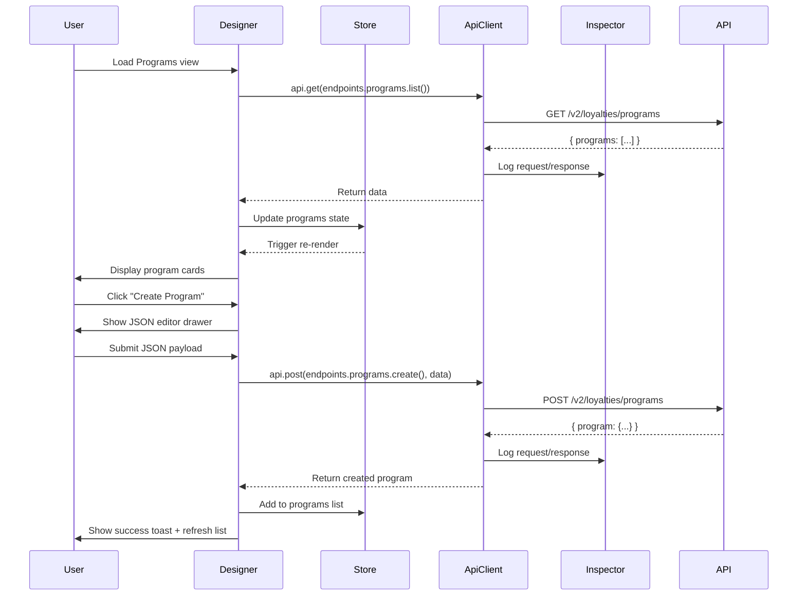
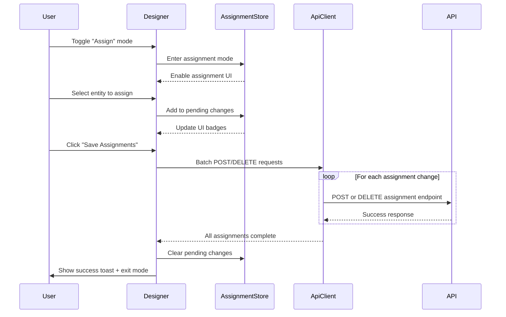
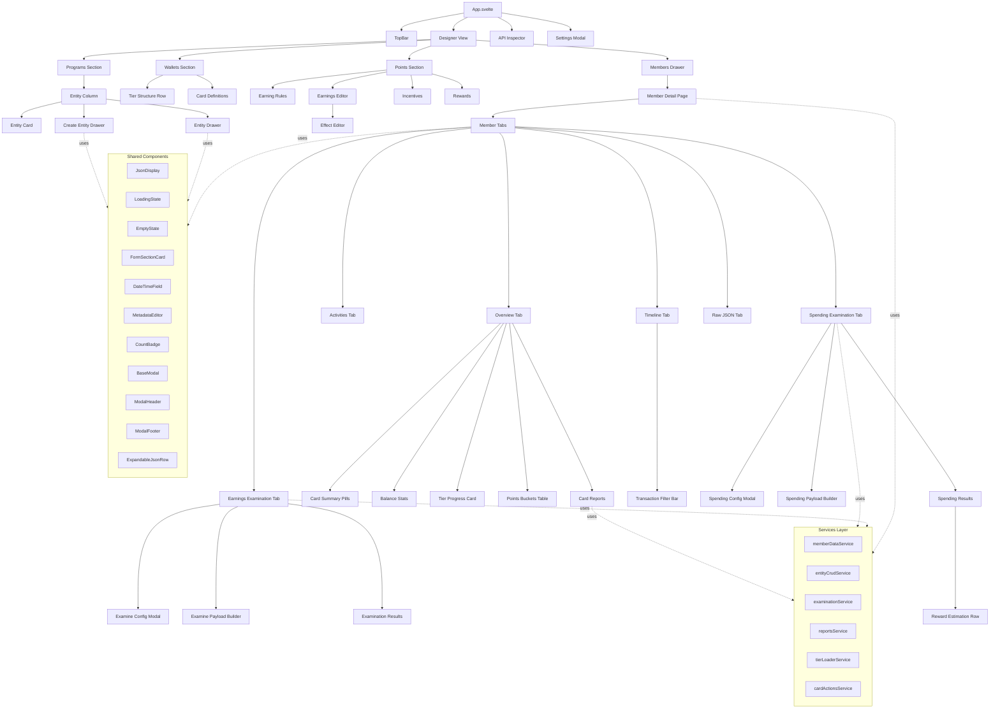
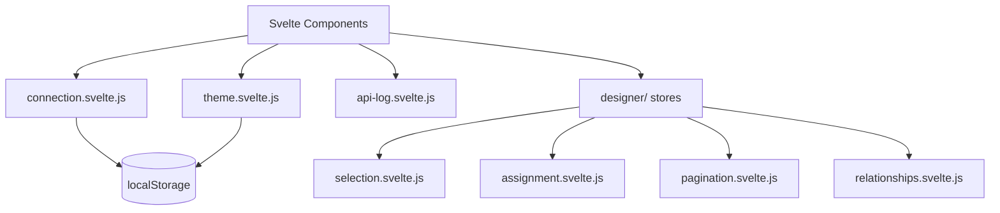
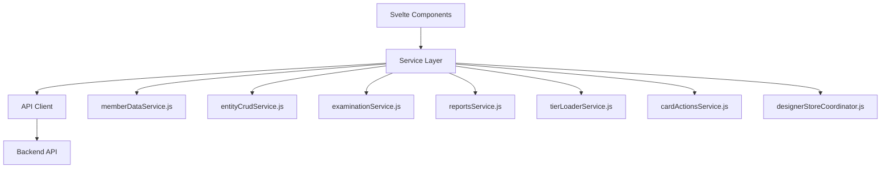
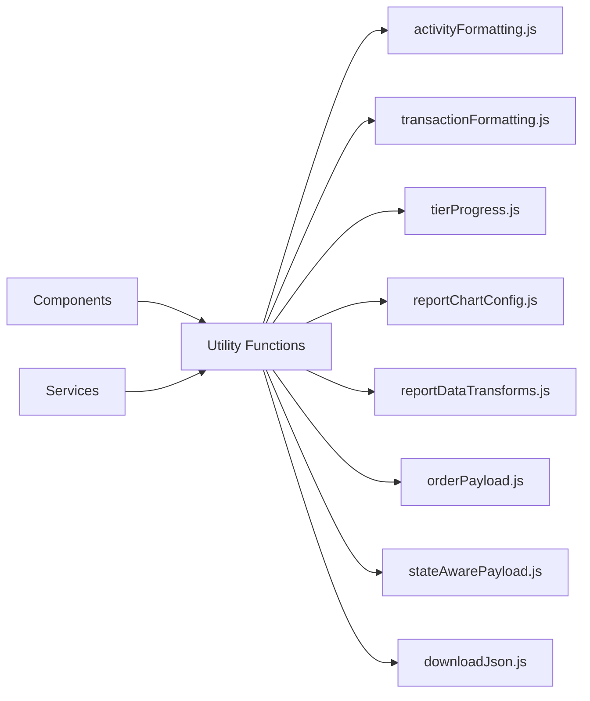
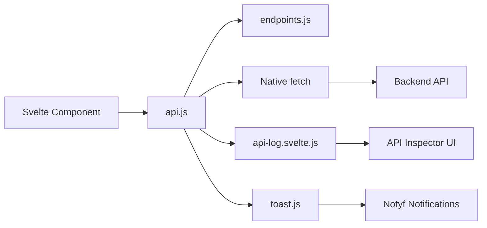

# Architecture

System design and technical decisions for Loyalty Workshop.

## Overview

Client-side SPA built with Svelte 5, communicating directly with any Voucherify Loyalty V2 API backend.



## Design Decisions

### 1. Why Svelte 5 with Runes?

**Decision**: Use Svelte 5 with runes instead of traditional stores or other frameworks.

**Rationale**:
- **Modern Reactivity**: `$state()`, `$derived()`, `$effect()` provide fine-grained reactivity
- **Better Performance**: Compiler optimizations, smaller runtime, faster updates
- **Improved DX**: More intuitive than `$:` syntax, better TypeScript support
- **Future-Proof**: Svelte 5 is the current version with long-term support

**Alternatives Considered**:
- React: More verbose, larger bundle, requires more boilerplate
- Vue 3: Good option, but Svelte offers better performance for this use case
- Svelte 4: Lacks modern runes, less ergonomic reactivity

### 2. Why Plain SPA (No SvelteKit)?

**Decision**: Build as a plain Svelte SPA without SvelteKit.

**Rationale**:
- **Simplicity**: No server-side rendering needed for a development tool
- **Single View**: App has one main view (Designer), no routing required
- **Deployment**: Can be deployed as static files to any CDN or web server
- **Backend Agnostic**: Works with any API endpoint, no server coupling

**Trade-offs**:
- No SSR/SSG capabilities (not needed for this tool)
- No file-based routing (not needed, single-view app)
- Manual state management (acceptable with rune-based stores)

### 3. Why CodeMirror for JSON Editing?

**Decision**: Use CodeMirror 6 for entity create/edit forms.

**Rationale**:
- **Developer Tool**: Target audience is comfortable with JSON
- **Flexibility**: Allows editing any entity structure without form constraints
- **Validation**: Built-in JSON syntax checking
- **Fast Implementation**: No need to build custom forms for every entity type

**Alternatives Considered**:
- Custom Forms: Would require building dozens of form components
- Textarea: No syntax highlighting, no validation
- Monaco Editor: Larger bundle size, overkill for this use case

### 4. Why Native Fetch Over Axios?

**Decision**: Use native `fetch` API with a thin wrapper.

**Rationale**:
- **No Dependencies**: Reduces bundle size and maintenance burden
- **Modern Standard**: Native browser API, well-supported
- **Sufficient Features**: All needed features available (headers, methods, JSON)
- **Custom Logging**: Easy to wrap for API Inspector integration

**Trade-offs**:
- No automatic retries (not needed for development tool)
- No request cancellation helpers (not a priority)
- Manual error handling (acceptable, provides flexibility)

### 5. Why localStorage for Credentials?

**Decision**: Store API credentials in browser `localStorage`.

**Rationale**:
- **Development Tool**: Not intended for production use with end users
- **Convenience**: Credentials persist across browser sessions
- **No Backend**: Aligns with static SPA architecture
- **Clear Warning**: Documented in security policy

**Security Considerations**:
- Clearly documented in [SECURITY.md](SECURITY.md)
- Not suitable for production deployments
- Users warned not to use production credentials

## Data Flow

### Application Initialization



### Entity Management Flow



### Assignment Mode Flow



## Component Hierarchy

### Top-Level Structure



### Component Categories

#### Layout Components
- `App.svelte` - Root component, mounts all top-level sections
- `TopBar.svelte` - Navigation and settings access
- `Designer.svelte` - Main view coordinator

#### Shared Components (`src/components/shared/`)
- **Display Components**: `JsonDisplay`, `LoadingState`, `EmptyState`, `CountBadge`, `ExpandableJsonRow`
- **Form Components**: `FormField`, `FormSectionCard`, `DateTimeField`, `ComplexFieldButton`, `MetadataEditor`, `KeyValueEditor`
- **Modal Components**: `BaseModal`, `ModalHeader`, `ModalFooter`
- **Layout Components**: `SectionHeading`, `AlertBanner`

#### Entity Management Components
- `EntityColumn.svelte` - Scrollable entity list
- `EntityCard.svelte` - Individual entity display card
- `EntityDrawer.svelte` - Entity detail with tabs (edit, activities, linked)
- `CreateEntityDrawer.svelte` - JSON editor for entity creation

#### Member Management Components
- `MembersDrawer.svelte` - Member list sidebar
- `MemberDetailPage.svelte` - Full member detail view with tabs
- `PointsBucketsTable.svelte` - Pending/expiring points display
- `TierProgressCard.svelte` - Tier progress visualization
- `TransactionFilterBar.svelte` - Transaction filtering UI
- `BalanceStats.svelte` - Balance statistics display
- `CardSummaryPills.svelte` - Card summary pills

#### Examination Components
- `ExamineConfigModal.svelte` - Earnings examination configuration
- `SpendingConfigModal.svelte` - Spending examination configuration
- `ExaminePayloadBuilder.svelte` - Earnings payload builder
- `SpendingPayloadBuilder.svelte` - Spending payload builder
- `ExaminationResults.svelte` - Earnings results display
- `SpendingResults.svelte` - Spending results display
- `RewardEstimationRow.svelte` - Reward estimation display

#### Earning Components
- `EarningRulesEarningsEditor.svelte` - Earnings configuration
- `EarningEffectEditor.svelte` - Effect configuration for earning rules

#### Wallet Components
- `TierStructureRow.svelte` - Tier structure display with progress

#### Chart Components (LayerCake)
- `StackedBars.svelte` - Stacked bar chart
- `MultiLine.svelte` - Multi-series line chart
- `AxisX.svelte` - X-axis component
- `AxisY.svelte` - Y-axis component
- `HoverLayer.svelte` - Mouse interaction layer

#### Utility Components
- `JsonSchemaEditor.svelte` - CodeMirror JSON editor
- `StatusBadge.svelte` - Entity status display
- `ConfirmationOverlay.svelte` - Inline confirmation for destructive actions
- `PaginationFooter.svelte` - Cursor-based pagination with countdown

## State Management

### Store Architecture

Loyalty Workshop uses Svelte 5 rune-based stores instead of traditional writable stores.



### Store Responsibilities

#### Global Stores

**`connection.svelte.js`**
- Manages API connection settings (base URL, app ID, app token)
- Persists to `localStorage`
- Provides connection status

**`theme.svelte.js`**
- Manages DaisyUI theme selection
- Persists to `localStorage`
- Applies theme to `<html>` data-theme attribute

**`api-log.svelte.js`**
- In-memory log of all API requests/responses
- Powers the API Inspector
- Includes timing, headers, bodies

#### Designer-Specific Stores

**`designer/selection.svelte.js`**
- Tracks selected program and entity
- Manages which entity drawer is open
- Coordinates view state

**`designer/assignment.svelte.js`**
- Tracks pending assignment changes
- Manages assignment mode state
- Handles batch save operations

**`designer/pagination.svelte.js`**
- Manages cursor-based pagination state
- Tracks cursor expiry times
- Handles load-more operations

**`designer/relationships.svelte.js`**
- Caches entity usage graphs
- Resolves bidirectional relationships
- Powers "Linked" tab in entity drawer

### Store Pattern

```javascript
// Svelte 5 rune-based store pattern
class MyStore {
  // Reactive state
  items = $state([]);
  loading = $state(false);
  error = $state(null);
  
  // Derived values
  get itemCount() {
    return this.items.length;
  }
  
  // Actions
  async loadItems() {
    this.loading = true;
    this.error = null;
    try {
      const response = await api.get(endpoints.items.list());
      this.items = response.data;
    } catch (err) {
      this.error = err.message;
    } finally {
      this.loading = false;
    }
  }
  
  addItem(item) {
    this.items.push(item);
  }
}

export const myStore = new MyStore();
```

## Service Layer

### Service Architecture

Services centralize business logic and API interactions, providing a clean separation between data/logic and UI.



### Available Services

#### Member Data Service (`memberDataService.js`)
**Purpose**: Centralize all member-related data fetching  
**Key Functions**:
- `fetchMember(memberId)` - Get member details
- `fetchCardOverview(programId, memberId, cardId)` - Get pending/expiring points
- `fetchMemberActivities(memberId)` - Get member activities
- `fetchCardActivities(programId, memberId, cardId)` - Get card activities
- `fetchCardTransactions(programId, memberId, cardId)` - Get merged card transactions
- `fetchMemberTransactions(memberId)` - Get merged member transactions

#### Entity CRUD Service (`entityCrudService.js`)
**Purpose**: Unified CRUD operations for all entity types  
**Key Functions**:
- `createEntity(entityType, payload)` - Create any entity
- `updateEntity(entityType, id, payload)` - Update any entity
- `deleteEntity(entityType, id)` - Delete any entity
- `activateEntity(entityType, id)` - Activate any entity
- `deactivateEntity(entityType, id)` - Deactivate any entity

#### Examination Service (`examinationService.js`)
**Purpose**: Centralize examination logic for earnings and spending  
**Key Functions**:
- `runEarningsExamination(payload)` - Execute earnings examination
- `runSpendingExamination(payload)` - Execute spending examination
- `createDefaultEarningsPayload(memberId)` - Generate default earnings scenario
- `createDefaultSpendingPayload(memberId)` - Generate default spending scenario
- `buildExaminationPayload(payload, handleSpecificTrigger)` - Clean and prepare payloads

#### Reports Service (`reportsService.js`)
**Purpose**: Centralize member card reports API calls  
**Key Functions**:
- `fetchCardReports(programId, memberId, cardId, params)` - Fetch daily reports
- `calculateDateRange(days)` - Calculate ISO date ranges

#### Tier Loader Service (`tierLoaderService.js`)
**Purpose**: Tier structure loading and caching  
**Key Functions**:
- `loadTiersForProgram(programId)` - Load tiers for a program

#### Card Actions Service (`cardActionsService.js`)
**Purpose**: Card-specific actions  
**Key Functions**:
- `activatePendingBucket(programId, memberId, cardId, bucketId)` - Activate pending points
- `cancelBucket(programId, memberId, cardId, bucketId)` - Cancel bucket
- `expireBucket(programId, memberId, cardId, bucketId)` - Expire bucket

#### Designer Store Coordinator (`designerStoreCoordinator.js`)
**Purpose**: Coordinate designer store state management  
**Key Functions**:
- Coordinates selection, assignment, and pagination stores
- Manages complex state transitions

### Service Pattern

```javascript
// Service pattern example
import { api } from '../api/client.js';
import { endpoints } from '../api/endpoints.js';

export async function fetchMember(memberId) {
  const response = await api.get(endpoints.members.get(memberId));
  return response.data || response;
}

export async function createEntity(entityType, payload) {
  const endpoint = endpoints[entityType].create();
  const response = await api.post(endpoint, payload);
  return response.data || response;
}
```

### Using Services in Components

```svelte
<script>
  import { fetchMember, fetchCardTransactions } from '../services/memberDataService.js';
  import { createEntity } from '../services/entityCrudService.js';
  
  let loading = $state(false);
  let member = $state(null);
  
  async function loadData() {
    loading = true;
    try {
      member = await fetchMember(memberId);
      const transactions = await fetchCardTransactions(programId, memberId, cardId);
      // Use data...
    } catch (err) {
      toast.error('Failed to load data');
    } finally {
      loading = false;
    }
  }
</script>
```

## Utilities Layer

### Utility Architecture

Utilities provide reusable helper functions for data formatting, transformation, and common operations.



### Available Utilities

#### Activity Formatting (`activityFormatting.js`)
**Purpose**: Centralized activity type badge colors  
**Key Functions**:
- `getActivityTypeColor(type)` - Returns DaisyUI badge class for activity types
- Consistent color coding: CREATE (success), UPDATE (warning), DELETE (error), etc.

#### Transaction Formatting (`transactionFormatting.js`)
**Purpose**: Format transaction data for display  
**Key Functions**:
- `formatTransactionType(type)` - Format transaction type for display
- `isNegativeTransaction(type)` - Check if transaction is negative

#### Tier Progress (`tierProgress.js`)
**Purpose**: Calculate tier progress and statistics  
**Key Functions**:
- `calculateTierProgress(currentPoints, tiers)` - Calculate tier progress percentage
- `getCurrentTier(currentPoints, tiers)` - Get current tier based on points
- `getNextTier(currentPoints, tiers)` - Get next tier and points needed

#### Report Chart Config (`reportChartConfig.js`)
**Purpose**: Chart configuration constants for reports  
**Exports**:
- `RANGE_OPTIONS`, `RESOLUTION_OPTIONS` - Control options
- `POS_KEYS`, `NEG_KEYS` - Point flow categories
- `FLOW_COLORS`, `FLOW_LABELS` - Color/label mappings
- `PENDING_SERIES` - Pending points series config

#### Report Data Transforms (`reportDataTransforms.js`)
**Purpose**: Data transformation utilities for reports  
**Key Functions**:
- Date utilities: `rawDate`, `fmtISO`, `parseLocal`, `generateDateRange`
- Gap filling: `fillChartGaps`
- Flow chart prep: `computeFlowSegments`, `computeFlowYDomain`
- Pending chart prep: `computePendingYDomain`, `hasPendingData`
- KPI calculation: `calculateKPIs`
- Formatters: `fmtDateTick`, `fmtTooltipDate`, `fmtYTick`, `computeXTickMod`

#### Order Payload (`orderPayload.js`)
**Purpose**: Build order payloads for API calls  
**Key Functions**:
- `buildOrderPayload(data)` - Build order payload from form data
- `validateOrderPayload(payload)` - Validate order payload

#### State-Aware Payload (`stateAwarePayload.js`)
**Purpose**: Build update payloads that only include changed fields  
**Key Functions**:
- `buildUpdatePayload(currentData)` - Build minimal update payload

#### Download JSON (`downloadJson.js`)
**Purpose**: Download JSON data as file  
**Key Functions**:
- `downloadAsJson(data, filename)` - Trigger browser download of JSON

### Utility Pattern

```javascript
// Utility pattern example
export function getActivityTypeColor(type) {
  const colorMap = {
    'CREATE': 'badge-success',
    'UPDATE': 'badge-warning',
    'DELETE': 'badge-error',
    'ACTIVATE': 'badge-info',
    'DEACTIVATE': 'badge-ghost'
  };
  return colorMap[type] || 'badge-ghost';
}
```

### Using Utilities in Components

```svelte
<script>
  import { getActivityTypeColor } from '../utils/activityFormatting.js';
  import { calculateTierProgress, getCurrentTier } from '../utils/tierProgress.js';
  import { downloadAsJson } from '../utils/downloadJson.js';
  
  const badgeClass = getActivityTypeColor(activity.type);
  const progress = calculateTierProgress(points, tiers);
  const currentTier = getCurrentTier(points, tiers);
  
  function handleExport() {
    downloadAsJson(memberData, 'member-data.json');
  }
</script>

<span class="badge {badgeClass}">{activity.type}</span>
<div class="progress">
  <div style="width: {progress}%"></div>
</div>
```

## API Integration

### API Client Architecture



### Request Flow

1. **Component calls API client**:
```javascript
const response = await api.get(endpoints.programs.list());
```

2. **API client adds headers**:
- `Content-Type: application/json`
- `X-Voucherify-API-Version: v2018-08-01`
- `X-App-Id`: from connection store
- `X-App-Token`: from connection store

3. **API client logs request**:
- Captures timestamp, method, URL, headers, body
- Adds to `apiLog` store

4. **Fetch executes request**:
- Native browser `fetch()` call
- Includes configured headers and body

5. **API client logs response**:
- Captures status, duration, headers, body
- Updates log entry in `apiLog` store

6. **Error handling**:
- Throws error if response not OK
- Error displayed via toast notification
- Full details available in API Inspector

### Endpoint Configuration

All endpoints defined in `src/api/endpoints.js`:

```javascript
export const endpoints = {
  programs: {
    list: () => '/v2/loyalties/programs',
    get: (id) => `/v2/loyalties/programs/${id}`,
    create: () => '/v2/loyalties/programs',
    update: (id) => `/v2/loyalties/programs/${id}`,
    delete: (id) => `/v2/loyalties/programs/${id}`,
    activate: (id) => `/v2/loyalties/programs/${id}/activate`,
    deactivate: (id) => `/v2/loyalties/programs/${id}/deactivate`,
    activities: (id) => `/v2/loyalties/programs/${id}/activities`
  }
  // ... more endpoints
};
```

### Query String Building

Helper in `src/api/queryString.js` for adding query parameters:

```javascript
import { withQuery } from '../api/queryString.js';

const url = withQuery(endpoints.programs.list(), {
  limit: 20,
  cursor: 'abc123',
  status: 'active'
});
// Result: /v2/loyalties/programs?limit=20&cursor=abc123&status=active
```

## Build and Deployment

### Development Build

```bash
npm run dev
```

- Vite dev server with HMR
- Source maps enabled
- Fast refresh on file changes
- Runs on port 3010

### Production Build

```bash
npm run build
```

Build process:
1. **Compile Svelte components** to JavaScript
2. **Bundle JavaScript** with Rollup
3. **Process CSS** with Tailwind (PostCSS)
4. **Minify assets** (JS, CSS)
5. **Generate source maps**
6. **Output to `dist/`** directory

Build output:
```
dist/
├── index.html           # Entry HTML
├── assets/
│   ├── index-[hash].js  # Main bundle
│   ├── index-[hash].css # Styles
│   └── [chunk]-[hash].js # Code-split chunks
└── vite.svg            # Favicon
```

### Deployment

Loyalty Workshop can be deployed as static files to:

- **Netlify**: Connect GitHub repo, automatic deploys
- **Vercel**: Zero-config deployment
- **GitHub Pages**: Free hosting for public repos
- **AWS S3 + CloudFront**: Scalable static hosting
- **Any static web server**: nginx, Apache, etc.

#### Example: Deploy to Netlify

1. Push code to GitHub
2. Connect repository in Netlify dashboard
3. Configure build settings:
   - Build command: `npm run build`
   - Publish directory: `dist`
4. Deploy automatically on push to main

#### Example: Deploy to nginx

```bash
npm run build
scp -r dist/* user@server:/var/www/loyalty-workshop/
```

nginx config:
```nginx
server {
  listen 80;
  server_name loyalty-workshop.example.com;
  root /var/www/loyalty-workshop;
  
  location / {
    try_files $uri $uri/ /index.html;
  }
}
```

### Environment Configuration

No build-time environment variables needed. All configuration is runtime:

- Base URL: Set in UI settings modal
- API credentials: Set in UI settings modal
- Theme: Selected in UI

This allows the same build artifact to work with any backend.

## Performance Considerations

### Bundle Size

Production bundle sizes (gzipped):
- **Main JS bundle**: ~150 KB
- **CSS**: ~30 KB
- **Total**: ~180 KB

### Code Splitting

Vite automatically code-splits:
- Chart components (loaded when viewing member details)
- CodeMirror (loaded when opening entity editor)
- Large vendor libraries (D3, LayerCake)

### Lazy Loading

Components are eagerly loaded since the app has a single view. Code splitting happens at the library level.

### Caching Strategy

- **Assets**: Cache-busted with content hashes in filenames
- **API responses**: No caching, always fetch latest data
- **localStorage**: Persists theme and credentials indefinitely

## Code Organization Improvements

### Refactoring Impact

The codebase has undergone comprehensive refactoring to improve maintainability:

**Shared Components**: 16 reusable components extracted
- Display: `JsonDisplay`, `LoadingState`, `EmptyState`, `CountBadge`, `ExpandableJsonRow`
- Form: `FormField`, `FormSectionCard`, `DateTimeField`, `ComplexFieldButton`, `MetadataEditor`, `KeyValueEditor`
- Modal: `BaseModal`, `ModalHeader`, `ModalFooter`
- Layout: `SectionHeading`, `AlertBanner`

**Service Layer**: 8 service modules created
- `memberDataService.js` - Member data fetching
- `entityCrudService.js` - Unified CRUD operations
- `examinationService.js` - Examination logic
- `reportsService.js` - Card reports API
- `tierLoaderService.js` - Tier structure loading
- `cardActionsService.js` - Card-specific actions
- `designerStoreCoordinator.js` - Designer state coordination
- `toast.js` - Toast notifications

**Utilities**: 8 utility modules
- `activityFormatting.js` - Activity type colors
- `transactionFormatting.js` - Transaction formatting
- `tierProgress.js` - Tier progress calculations
- `reportChartConfig.js` - Chart configuration
- `reportDataTransforms.js` - Data transformations
- `orderPayload.js` - Order payload building
- `stateAwarePayload.js` - State-aware updates
- `downloadJson.js` - JSON download helper

**Impact**: ~2,250 lines removed/simplified, improved consistency, better maintainability

## Security Architecture

### Threat Model

Primary concerns:
1. **Credential Exposure**: API credentials stored in localStorage
2. **XSS Attacks**: User-provided JSON in entity editor
3. **API Key Leakage**: Screenshots/logs shared publicly

### Mitigations

1. **Clear Documentation**: Security policy explains risks
2. **Development-Only**: Not intended for production use
3. **No Server-Side Code**: Reduces attack surface
4. **Content Security Policy**: Can be added via meta tag
5. **API Inspector Warning**: Reminds users logs contain sensitive data

### Future Improvements

- Optional encrypted credential storage
- Session-based authentication support
- CSP headers in deployment examples

## Related Documentation

- [DEVELOPMENT.md](DEVELOPMENT.md) - Development setup and workflow
- [STYLE_GUIDE.md](STYLE_GUIDE.md) - Coding conventions
- [API.md](API.md) - API reference
- [CONTRIBUTING.md](CONTRIBUTING.md) - Contribution guidelines
